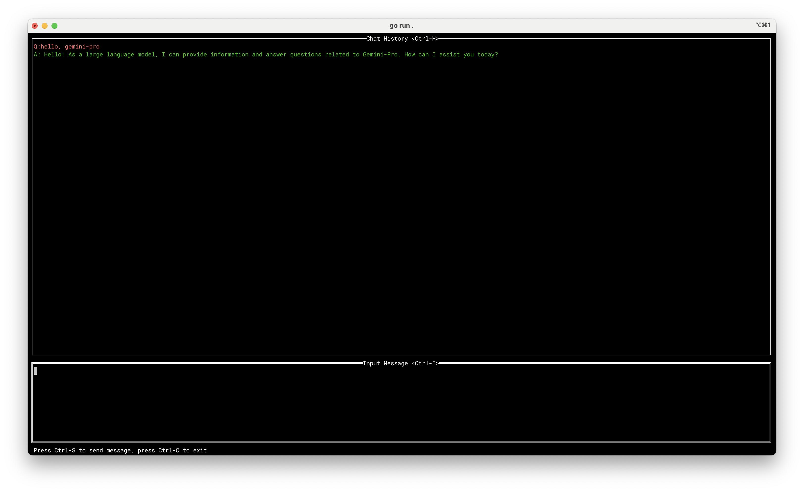

# Gemini Terminal

[[English]](./README.md) [[中文]](./README_zh.md) [[日本語]](./README_jp.md)

Gemini Terminal is a chat application based on Google AI. You can use it by following the steps below.



## Installation and Usage

1. Clone this repository

```bash
git clone https://github.com/greycodee/gemini-terminal.git
```

2. Build the project

```bash
cd gemini-terminal && go build .
```

3. Run the project

```bash
./gemini-terminal
```

> Note: You need to set your own Google AI key in the `$HOME/.local/share/gemini/config.ini` file.

## Configuration

The default configuration file is located at `$HOME/.local/share/gemini/config.ini`. You can set your Google AI key and Gemini model name in this file.

```ini
[Gemini]
# set your own google ai key
googleAIKey=
# set gemini model name
model=gemini-pro
[SafetySetting]
# HarmBlockUnspecified HarmBlockThreshold = 0
# HarmBlockLowAndAbove means content with NEGLIGIBLE will be allowed.
# HarmBlockLowAndAbove HarmBlockThreshold = 1
# HarmBlockMediumAndAbove means content with NEGLIGIBLE and LOW will be allowed.
# HarmBlockMediumAndAbove HarmBlockThreshold = 2
# HarmBlockOnlyHigh means content with NEGLIGIBLE, LOW, and MEDIUM will be allowed.
# HarmBlockOnlyHigh HarmBlockThreshold = 3
# HarmBlockNone means all content will be allowed.
# HarmBlockNone HarmBlockThreshold = 4
level=4
```

## Chat History

The default database file is located at `$HOME/.local/share/gemini/gemini.db`. You can view your chat history in this file.
